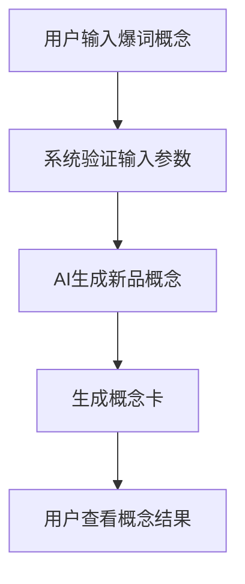

# AI产品创新平台 PRD

## 版本记录
| 版本 | 日期 | 修订人 | 备注 |
|------|------|--------|------|
| V1.0 | 2026-04-14 | 系统生成 | 初始版本 |

## 一、概述

### 1.1 产品概述及目标

#### 1.1.1 背景介绍
在当前市场环境下，产品创新已成为企业核心竞争力的关键因素。传统的产品研发模式往往依赖于经验和直觉，缺乏数据驱动的决策支持。同时，市场上的成功新品往往是现有产品元素的创新排列组合，如乌龙茶心脆巧球、褪黑素安睡酸奶等。

#### 1.1.2 产品概述
AI产品创新平台是一款基于市场爆词分析的智能工具，通过分析热销产品的爆词元素，实现跨品类的创新组合，为产品研发人员提供数据驱动的新品概念生成服务。

#### 1.1.3 产品目标
- **业务目标**：提高新品研发效率，降低创新风险，提升市场成功率
- **用户目标**：快速获取基于数据的创新灵感，生成符合市场趋势的新品概念

#### 1.1.4 目标用户
- 产品研发人员
- 市场分析人员

### 1.2 名词说明
| 名词 | 解释 |
|------|------|
| 主品类 | 产品的核心品类，如巧克力 |
| 副品类 | 跨界融合的元素来源品类，如饮料 |
| 主爆词 | 从主品类爆词库中选择的热门元素，如黑咖啡巧克力、海盐生巧 |
| 副爆词 | 从副品类爆词库中选择的热门元素，如乌龙茶、白芽奇兰、米酿 |
| 融合方向 | 主副品类的组合方式，如副爆词融入主爆词、主副对等融合 |
| 概念卡 | 包含新品概念核心信息的可视化卡片 |

### 1.3 角色及权限
| 角色 | 权限 |
|------|------|
| 产品研发人员 | 可使用平台生成新品概念，查看概念卡 |
| 市场分析人员 | 可使用平台生成新品概念，查看概念卡 |

### 1.4 文档阅读对象
- 产品经理
- 开发工程师
- 测试工程师
- 业务相关人员

## 二、产品描述

### 2.1 产品需求描述
AI产品创新平台需要实现以下核心功能：
1. 接收用户输入的爆词概念（主品类、主爆词、副品类、副爆词等）
2. 根据输入参数生成符合要求的新品概念
3. 生成包含概念核心信息的概念卡
4. 支持不同创意风格的概念生成（保守、适中、激进）

### 2.2 产品整体流程



### 2.3 全局说明
- **异常处理**：输入参数不完整时，系统应提示用户补充信息
- **列表规则**：爆词列表应按热度排序，方便用户选择
- **全局交互**：操作成功后应给予明确的反馈提示

### 2.4 产品版本规划
| 版本 | 功能 | 上线时间 |
|------|------|----------|
| V1.0 | 核心概念生成功能 | 2026-Q2 |
| V1.1 | 概念卡渲染优化 | 2026-Q3 |
| V1.2 | 历史概念管理 | 2026-Q4 |

### 2.5 产品框架
- **前端**：Web界面，用于输入参数和展示概念卡
- **后端**：AI概念生成引擎，处理爆词组合和概念生成
- **数据**：用户提供的Excel爆词数据

### 2.6 功能清单
| 功能模块 | 功能点 | 描述 |
|----------|--------|------|
| 爆词输入 | 参数配置 | 支持主品类、副品类、主爆词、副爆词、融合方向、生成数量、创意风格、目标人群的输入 |
| 概念生成 | AI算法处理 | 根据输入参数生成符合要求的新品概念 |
| 概念卡渲染 | 可视化展示 | 生成包含概念核心信息的概念卡 |
| 结果管理 | 历史记录 | 保存和管理生成的概念历史 |

## 三、功能需求

### 3.1 爆词输入
- **描述**：用户通过界面输入爆词相关参数
- **用户故事**：作为产品研发人员，我希望能方便地输入爆词参数，以便系统生成符合需求的新品概念
- **前置条件**：用户已登录系统
- **后置条件**：系统接收到完整的输入参数
- **界面及交互**：
  - 主品类选择下拉框
  - 副品类选择下拉框
  - 主爆词多选框
  - 副爆词多选框
  - 融合方向单选框
  - 生成数量输入框
  - 创意风格单选框
  - 目标人群输入框
  - 提交按钮
- **业务流程**：用户填写参数 → 点击提交 → 系统验证参数 → 进入概念生成
- **异常/分支流程**：参数不完整时，系统提示用户补充信息

### 3.2 概念生成
- **描述**：系统根据输入参数生成新品概念
- **用户故事**：作为产品研发人员，我希望系统能快速生成高质量的新品概念，以便我评估其市场潜力
- **前置条件**：系统已接收到完整的输入参数
- **后置条件**：系统生成符合要求的新品概念
- **界面及交互**：
  - 生成状态显示
  - 概念结果展示
- **业务流程**：系统处理输入参数 → AI生成概念 → 结果格式化
- **异常/分支流程**：生成失败时，系统提示错误信息

### 3.3 概念卡渲染
- **描述**：系统生成包含概念核心信息的概念卡
- **用户故事**：作为产品研发人员，我希望能看到美观的概念卡，以便更直观地理解新品概念
- **前置条件**：系统已生成新品概念
- **后置条件**：系统生成概念卡
- **界面及交互**：
  - 概念卡展示区域
  - 卡片下载按钮
- **业务流程**：系统获取概念数据 → 渲染概念卡 → 展示给用户
- **异常/分支流程**：渲染失败时，系统提示错误信息

### 3.4 结果管理
- **描述**：系统保存和管理生成的概念历史
- **用户故事**：作为产品研发人员，我希望能查看和管理历史生成的概念，以便进行比较和分析
- **前置条件**：系统已生成过概念
- **后置条件**：用户可查看历史概念
- **界面及交互**：
  - 历史概念列表
  - 概念详情查看
- **业务流程**：系统保存概念 → 用户查看历史 → 选择概念查看详情
- **异常/分支流程**：无

## 四、非功能需求

### 4.1 安全与合规
- 系统应确保用户数据的安全存储
- 符合相关数据隐私法规

### 4.2 统计需求（埋点）
- 记录用户输入参数的分布
- 记录概念生成的成功率
- 记录用户对概念的满意度

### 4.3 性能需求
- 概念生成响应时间不超过3秒
- 系统支持同时处理10个并发请求

### 4.4 数据库设计
- 存储用户输入的参数
- 存储生成的概念结果
- 存储历史概念记录

### 4.5 系统集成
- 与Excel文件导入功能集成
- 与后续的图文生成服务集成

## 五、附录

### 5.1 验收标准与测试要点
| 功能 | 验收标准 | 测试要点 |
|------|----------|----------|
| 爆词输入 | 所有参数能正确输入和验证 | 测试参数完整性校验 |
| 概念生成 | 能生成符合要求的新品概念 | 测试不同参数组合的生成结果 |
| 概念卡渲染 | 能正确渲染包含所有核心信息的概念卡 | 测试不同概念的渲染效果 |
| 结果管理 | 能正确保存和显示历史概念 | 测试历史记录的完整性 |

### 5.2 概念生成JSON格式
```json
{
  "concept_name": "4-8个字，朗朗上口，体现融合元素",
  "tagline": "8-12个字，一句打动人的slogan",
  "core_selling_point": "30-50字，说清楚独特价值",
  "target_scenario": "2-3个典型使用场景",
  "sensory_description": "30-50字，描述口味/质地/体验",
  "suggested_price_range": "合理价格带",
  "inspiration_from": "爆词组合"
}
```

### 5.3 概念卡渲染内容
| 区域 | 数据来源 |
|------|----------|
| 主标题 | AI生成的 concept_name |
| 副标题/Slogan | tagline |
| 核心卖点（3个icon+文案） | 从 core_selling_point 拆解，或让AI额外输出 bullet_points |
| 场景插图描述 | 让AI额外输出 image_prompt（用于后续文生图） |
| 价格带 | suggested_price_range |
| 爆词溯源标签 | inspiration_from + 主品类/副品类 |